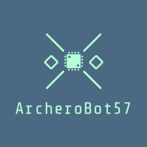
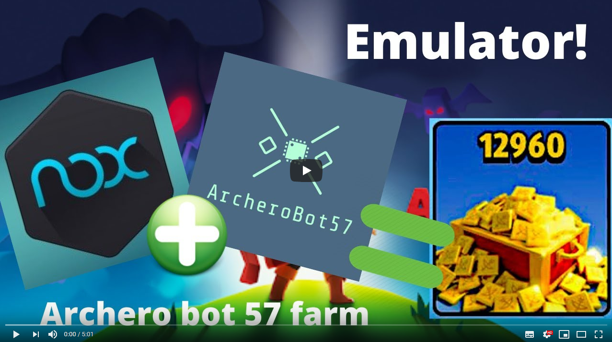
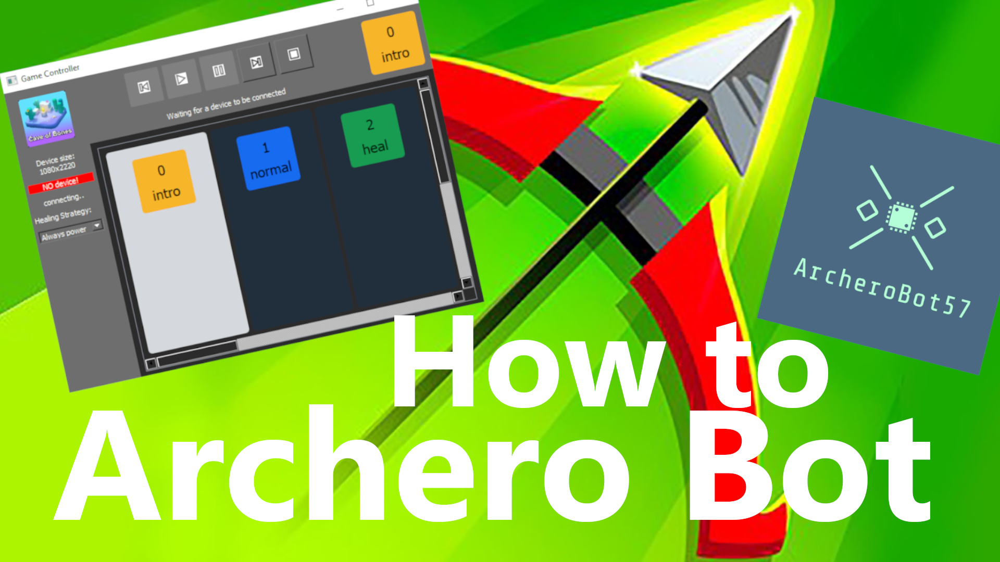

# Archero Bot 57

  

Link to project report [here](https://drive.google.com/file/d/1XNmw7Y6tWK9RgFCfA8D5IR0QW33SuNl1/view?usp=sharing) and presentation ppt [here](https://docs.google.com/presentation/d/1nsljsOx4Gm5zqlYnrV9i76_Bf3rhMB8ho33xZHl8He8/edit?usp=sharing)

Watch the installation video, Nox emulator installation and fast usage videos:

## Contents
- [Introduction](#introduction)
- [Installation](#installation) (go to [this](wiki/Installation.md) link)
- [Usage](#usage)
- [Game Description](#game-description)
- [Coordinates management](#coordinates-management)
- [How it works](#how-it-works)
- [Coordinates check explained](#coordinates-check-explained)
- [Extra](#extra)

## Introduction 
This is an archero bot that works on a mobile smartphone connected with usb cable.
It was originally build to continously start a game (dungeon 6: the cave), play it until end and loop until energy bar is below 5. Then wait for energy to restart.

- Supported OS:
  - Windows
  - Ubuntu/Linux distro
  - MAC OS (tested once)

- Supported platform:
  - Usb connection to phone (with 1080x1920 resolution mandatory)
  - Nox emulator

- Supported dungeons:
  - 3 . Abandoned Dungeon: tested, FAILING
  - 6 . **The Cave: tested, WORKING**
  - 10 . The Cave: tested, FAILING

- Tested resolutions
  - 1080x1920 is full working. Remaining tests have to be done
  - 1080x2220, 1080x2280 and 1080x2340 are DEPRECATED. They were added to fit various smartphones but development became a nightmare.

- Equipment:
  - Try to use all **dodging equip** and life/atk gaining equipment
  - does **NOT** work with **enlightement** book (yet)

If you don't find your screen resolution and you want to contribue, follow these [instructions](wiki/ContributeWithScreens.md).

## Installation

Installation steps can be found in [this wiki page](wiki/Installation.md).

## Usage

Simple explanation video [here](https://www.youtube.com/watch?v=XbjphfEp8yw):

Once cloned the repo and installed all necessary stuff, execute **GameController.py**.
\\
Wait for the interface to connect to the device. It will automatically try to connect to phone or to Nox emulator.
\\
Once connected, just manually open your app on phone/emulator and let it on the main menu screen with level 6 "the Cave" selected. If you have notifications or first game setuup, please manually do it before.
\\
Now you can press the play button and it will start playing over and over again until no more energy is left.
\\
If somehow it screwes up, just go to the following room. do not press anything once entered a new room. Then select the room number you're in inside the GameController and press start again.
If you are in the intro level, please go to level 1, select it and press play.
\\
If you pause and want to start again, you have to manually go to the next room and select its number from GameController.
This is needed because when pressing play, the bot will start thinking that you are at the start of the room in center position.

### Game description
Set dungeon to **The Cave** (number 6) and run the executable GameController.py:
\
If you launch from terminal, it is possible to specify the starting level of first run (e.g. `python static_bot_cave.py 16`).
\
If setting start from 0, the program will check your energy. If 5 or above, then starts a game and plays until he dies. He normally does between 12 to 20 levels.
\
Once it ends, he goes to main menu and checks another time if it has energy.
This program is not perfect. If he somehow thinks to be on a different level but the game is ahead, please manually end the game, return to main menu and restart the game.
\
Even if it will fail, no harm will be done (it will not exit and click randomly on your phone).

## Coordinates Management
### Static coordinates check

The bot takes screenshots over time and detecting what is currently on the screen is a requested operation before starting the bot.
With this said you have to execute **check_static_coors.py** and checking that each row starts with **OK**.

If some **NO_DETECTION** are found, don't start the bot.
Other **MULTIPLE_DETECTIONS** are allowed.

### Coordinates check
If the program is clicking in wrong places, then use [TouchManager](TouchManager.py) script.
Create a folder with all your screenshots.
Set [images_path](https://github.com/fabian57fabian/archero_bot_57/blob/7c698dc856576cb986093dd3b352cb54c774df84/checkCoordinates.py#L46) to screenshots path.
launch TouchManager script and use the interface (for windows double-click on 'checkCoordinates.py.').
Current version: basic_usage.

## How it works
The package adb lets us use various android tools like:
- tapping on a screen coordinate
- swiping between two points in an amount of time
- taking a screenshot

With those functions, i built a dictionary with needed coordinates (in datas/default_dict.py) to start with.

All coordinates are normalized in [0, 1]. This is done because then we will set our screen width and height according to the phone screen used.

Using the TouchManager app we can check each point location for each screenshot that we have (default folder images/samsungs8+).

When we are in need to check something on the screen, we take a screenshot (saved as 'screen.png'), load the image as a list of pixels and get from it a set of pixel locations. Then check those with our needed pixels. All this is done in the game_screen_connector script.
For example when checking if having 5 or more energy to play one game, we check that pixel corresponding to 5th bar of energy is blue:

### Coordinates check explained
In order to detect the game state, a static coordinate check is done.
For each interesting state (on pause, on devil question, on skill choose) there is a list of (x,y) coordinates that checks if the color is in a specific color range.
Example:
\
Checking 'endgame' consist in checking that we see the 'blue' color in 3 different points.
\
These coordinates have to have red, green, blue colors in an interval being (48, 98, 199) +- 5.
\
In the future implementation, this hole static check will be replaced by a neural network model trained to automatically detect those data in the screenshot.

## Issue: Adb not working
If adb doesn't work or installation failed, check out this [video](https://www.youtube.com/watch?v=vr0GLIufzkM). It explains how to install on windows and ubuntu.

## Statistics saving

Every game statistics is saved in datas folder as a **statisics** csv file. It can be opened by LibreOffice or Excel.
\
This is usefull in future games plotting to know how it performed.

## Extra

Thanks to [RimanCz](https://github.com/RimanCz) for screenshorts done with Samsung S10e (1080x2280).
\
Thanks to [MahirZukic](https://github.com/MahirZukic) for screenshorts done with Xiaomi Mi 9 (1080x2340).
\
Thanks to [AgamemnonasKyr](https://github.com/AgamemnonasKyr) for screenshots done for upper black strip in game (1080x2280).
\
For any bug open an issue.
If not having a github account, email me at **fabian_57@yahoo.it**.
