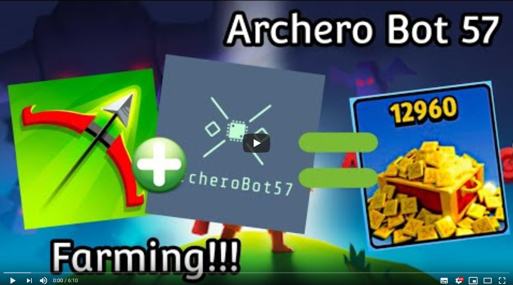
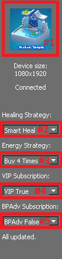

# Archero Bot 57

Installation videos (youtube playlist):

If you want, you can send me a beer here:

 

## Contents
- [Introduction](#introduction)
- [Installation](#installation) (go to [this](wiki/Installation.md) link)
- [Usage](#usage)
- [Game Description](#game-description)
- [Coordinates management](#coordinates-management)
- [How it works](#how-it-works)
- [Auto ability check](#auto-ability-check)
- [Coordinates check explained](#coordinates-check-explained)
- [Extra](#extra)

## Introduction 
This is an archero bot that can work on a mobile smartphone connected with usb cable, but designed specificly for NOX emulator at 1080x1920 mobile resolution.
It was originally built to continously start a game (dungeon 6: the cave), play it until end and loop until energy bar is below 5. Then wait for energy to restart. It has since been expanded: designed and tested speifically for dungeon caves 3, 6, and 10 (for both normal and hero modes). It can also do other levels 1-16, though some not very well (i.e. it will step on every spike and sawblade, and GUI level display boxes will not match up with actual levels. If you plan to try the other levels beside 3, 6, or 10, results will vary depending on how OP your character is for that level.

- Supported OS:
  - Windows
  - Ubuntu/Linux distro
  - MAC OS (tested once)

- Supported platform:
  - Usb connection to phone (with 1080x1920 resolution mandatory)
  - Nox emulator

- Supported dungeons (Normal and Boss Modes):
  - 3 . **Abandoned Dungeon: tested, WORKING**
  - 6 . **The Cave: tested, WORKING**
  - 7 . **Barens of Shadow: tested, WORKING**
  - 10 . **Land of Doom: tested, WORKING**
  - 14 . **Frigid Tundra: tested, WORKING**
  - 16 . **Archic Temple: tested, WORKING**
  - 18 . **Escape Chamber: tested, WORKING**
  - 20 . **Palace of Light: tested, WORKING**
  - 1-15 . Other dungens: tested, works some (use at own peril)...

- GUI Options Explained:
  - 1: Click Icon, choose selected cave to run. If switching between 10, 20, 30, and 50-room dungeons, you must close and re-open the bot to load the correct GUI screen.
  - 2: Choose Heal Strategy, Always Power (always chooses left), Always Heal (always chooses right), or Smart Heal (chooses left if above 50% HP and right if below 50% HP).
  - 3: Choose Energy Strategy, Do Not Buy Energy or Buy 1, 2, 3, or 4 Energy (**buy energy uses gems**)
  - 4: Do you pay for Value Rewards or VIP Rewards Subscription?  If yes, choose True ( Automatically claims VALUE/VIP rewards daily for you). If you don't pay for a subscription choose False. If VIP=True and BuyEnergy>0, the energy count will restart every 24 hours allowing continuous buying of extra energy daily. 
  - 5: Do you pay for the "Battle Pass Advanced" Subscription? If yes, choose True ( Automatically claims Battle Pass Advanced rewards daily for you). If you don't pay for a subscription choose False. Does not work with a standard battle pass ONLY the advanced one!
  - 6: Check If Dead, will try to revive you if you die in game. **Uses GEMS**, unless you pay for Battle Pass Advanced Sub. Slows down gameplay some and currently works <50% of the time.

- Tested resolutions:
  - 1080x1920 is full working.
  - other resolutions are DEPRECATED.

## Installation

Installation steps can be found in [this wiki page](wiki/Installation.md).

## Usage

Simple explanation video [here](https://www.youtube.com/watch?v=XbjphfEp8yw):

Once cloned the repo and installed all necessary stuff, execute **GameController.py**.

Wait for the interface to connect to the device. It will automatically try to connect to phone or to Nox emulator.

Once connected, just manually open your app on phone/emulator and let it on the main menu screen with the correct level as you selected in GUI Options #1. If you have notifications or first game setup, please manually do it before.

Now you can press the play button and it will start playing over and over again until no more energy is left.

If somehow it screwes up, just press the stop button, manually put your archer in next room at bottom. do not press anything once entered a new room. Then select the room number you're in inside the GameController and press start again. If you are in the intro level, please go to level 1, select it and press play.

If you pause and want to start again, you have to manually go to the next room and select its number from GameController GUI. This is needed because when pressing play, the bot will start thinking that you are at the start of the room in center position.

- Equipment suggestion:
  - Try to use all **dodging equip** and life/atk gaining equipment
  - do **NOT** use **enlightement** book (yet)

### Game description
If you start the bot when inside main game menu, the program will check your energy. If 5 or above, then starts a game and plays until he dies or reaches endgame. Once it ends, he goes to main menu and checks another time if it has energy.

This program is not perfect, but I have installed options which should allow it to continue playing and eventually correct itself (in most cases). Even if it does fail, no harm will be done (it should exit and should not click randomly on your phone).

## Coordinates Management
### Static coordinates check

The bot takes screenshots over time and detecting what is currently on the screen is a requested operation before starting the bot. With this said you can execute **check_static_coors.py** and checking that each row starts with **OK**. Other **MULTIPLE_DETECTIONS** are allowed. If some **NO_DETECTION** are found, error might happen durring gameplay.

### Coordinates check
If the program is clicking in wrong places, then use [TouchManager](TouchManager.py) script.
Create a folder with all your screenshots.
Set [images_path](https://github.com/fabian57fabian/archero_bot_57/blob/7c698dc856576cb986093dd3b352cb54c774df84/checkCoordinates.py#L46) to screenshots path.
launch TouchManager script and use the interface (for windows double-click on 'TouchManager.py.').
Current version: basic_usage.

## How it works
The package adb lets us use various android tools like:
- tapping on a screen coordinate
- swiping between two points in an amount of time
- taking a screenshot

With those functions, i built a dictionary with needed coordinates (in datas/default_dict.py) to start with.

All coordinates are normalized in [0, 1]. This is done because then we will set our screen width and height according to the phone screen used.

Using the TouchManager app we can check each point location for each screenshot that we have (default folder images/samsungs8+).

When we are in need to check something on the screen, we take a screenshot (saved as 'screen.png'), load the image as a list of pixels and get from it a set of pixel locations. Then check those with our needed pixels. All this is done in the game_screen_connector script.
For example when checking if having 5 or more energy to play one game, we check that pixel corresponding to 5th bar of energy is blue:

### Coordinates check explained
In order to detect the game state, a static coordinate check is done.
For each interesting state (on pause, on devil question, on skill choose) there is a list of (x,y) coordinates that checks if the color is in a specific color range.
Example:

Checking 'endgame' consist in checking that we see the 'blue' color in 3 different points.

These coordinates have to have red, green, blue colors in an interval being (48, 98, 199) +- 5.

In the future implementation, this hole static check will be replaced by a neural network model trained to automatically detect those data in the screenshot.

## Auto ability check
When a 'choose new ability' screen arrives, it recognizes every ability and choose the best one based on a *tier list*.

This can be found in datas/abilities/tier_list.json and every ability template can be found in datas/abilities/abilities_templates .

A future work will be to integrate an UI to drag and drop abilities and changing the tier list.

## Issue: Adb not working
If adb doesn't work or installation failed, check out this [video](https://www.youtube.com/watch?v=vr0GLIufzkM). It explains how to install on windows and ubuntu.

## Statistics saving

Every game statistics is saved in datas folder as a **statisics** csv file. It can be opened by LibreOffice or Excel.
\
This is usefull in future games plotting to know how it performed.

## Extra

Link to project report [here](https://drive.google.com/file/d/1XNmw7Y6tWK9RgFCfA8D5IR0QW33SuNl1/view?usp=sharing) and presentation ppt [here](https://docs.google.com/presentation/d/1nsljsOx4Gm5zqlYnrV9i76_Bf3rhMB8ho33xZHl8He8/edit?usp=sharing)

Thanks to [RimanCz](https://github.com/RimanCz) for screenshorts done with Samsung S10e (1080x2280).
\
Thanks to [MahirZukic](https://github.com/MahirZukic) for screenshorts done with Xiaomi Mi 9 (1080x2340).
\
Thanks to [AgamemnonasKyr](https://github.com/AgamemnonasKyr) for screenshots done for upper black strip in game (1080x2280).
\
Thanks to [AdminZero](https://github.com/AdminZero) for his incredible work on adding features, testing on different levels, donating to the bot and unlocking new ways of going thru dungeon.
\
For any bug open an issue.
If not having a github account, email me at **fabian_57@yahoo.it**.
